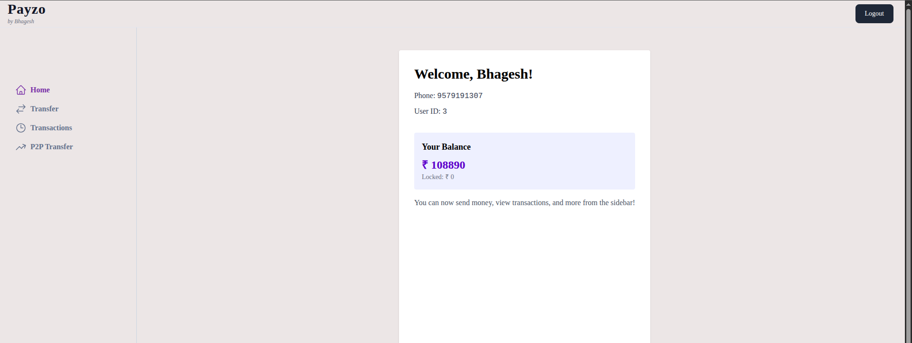
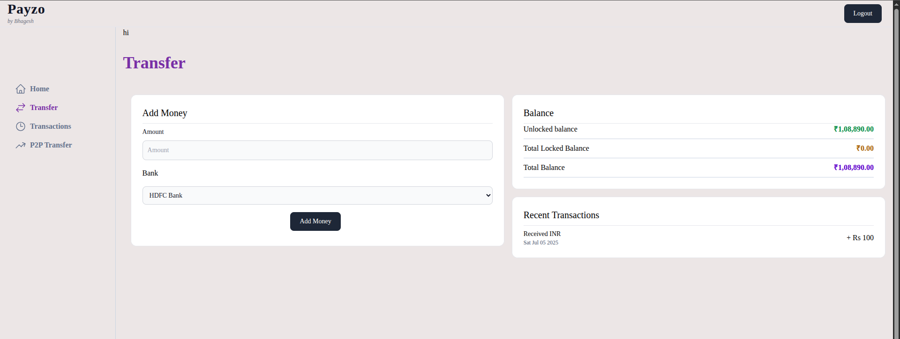
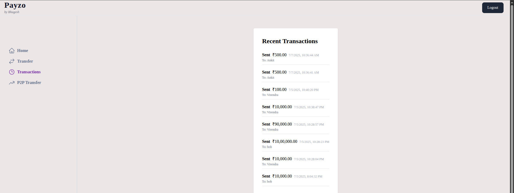
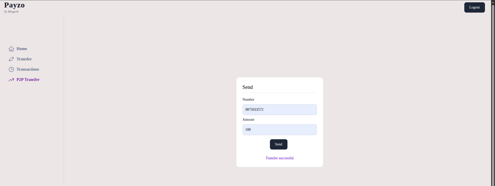

# 💸 Payzo – Peer-to-Peer Digital Payments App

**Payzo** is a full-stack MERN (MongoDB, Express, React, Node.js) application that enables secure P2P payments, bank transfers, and transaction management. Designed for performance, clarity, and simplicity.

> Built with ❤️ by [Bhagesh Vilas Chavan](https://github.com/Bhagesh07)

---

## ✨ Features

- 🔐 Secure Login/Logout with JWT
- 🏦 Bank-to-Bank Money Transfer
- 🔁 Peer-to-Peer (P2P) Payment via phone number
- 📊 View Complete Transaction History
- 🖥️ Dashboard UI with TailwindCSS
- 🌐 Deployed with Vercel (Frontend) & Render (Backend)
- 🧩 Modular, Scalable Folder Structure with Turborepo

---

## 🖼️ Screenshots

### 🏠 Dashboard  


### 💳 Bank Transfer  


### 📊 Transactions  


### 🔁 P2P Transfer  


---

## 📁 Folder Structure

```bash
Payzo/
├── apps/
│   └── user-app/         # React frontend with Tailwind
├── packages/
│   └── db/               # Prisma DB models and client
├── docker/               # Docker-related files
├── assests/              # App screenshots
├── .github/workflows/    # CI/CD configs
├── .env.example          # Sample environment variables
└── README.md             # This file


## 🛠️ Tech Stack

| Layer      | Tech                          |
|------------|-------------------------------|
| Frontend   | React.js, Tailwind CSS        |
| Backend    | Node.js, Express.js           |
| Database   | MongoDB + Prisma ORM          |
| Auth       | JWT (JSON Web Tokens)         |
| Deployment | Vercel (UI) + Render (API)    |
| Tooling    | TurboRepo, Docker             |


# Clone the repo
git clone https://github.com/Bhagesh07/Payzo.git
cd Payzo

# Install dependencies
npm install

# Copy env template
cp .env.example .env

# Start frontend
cd apps/user-app
npm run dev

# Start backend (if separated)
cd ../../packages/api
npm start

